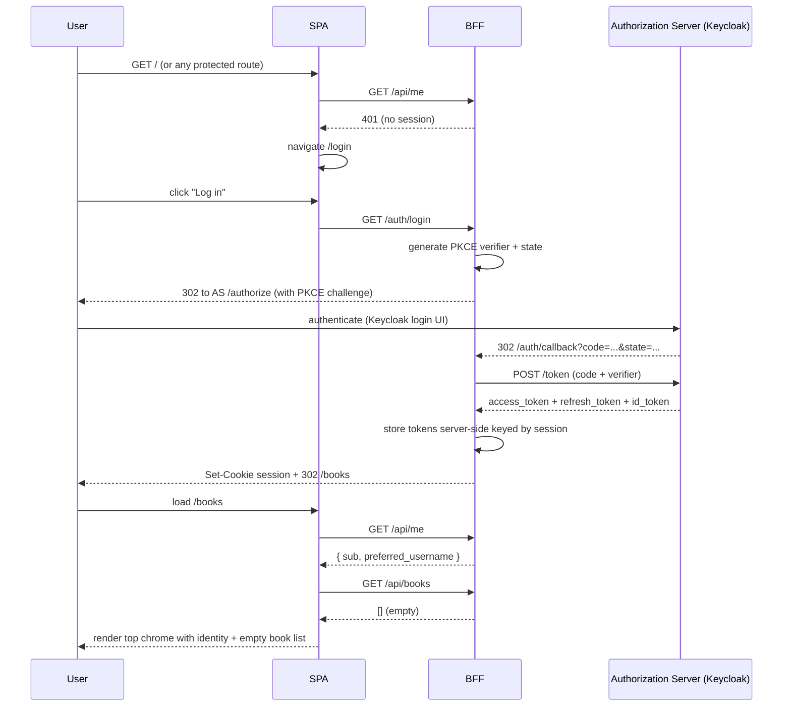
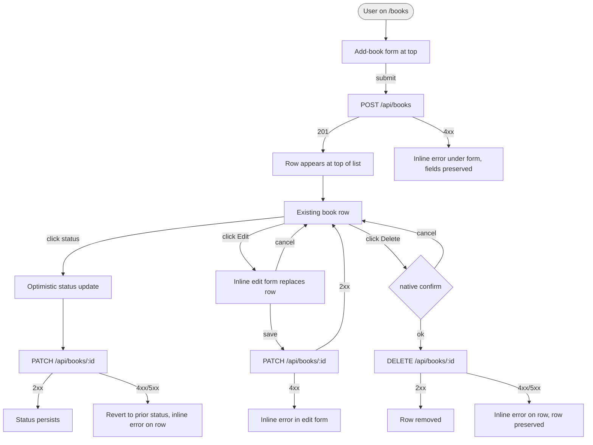
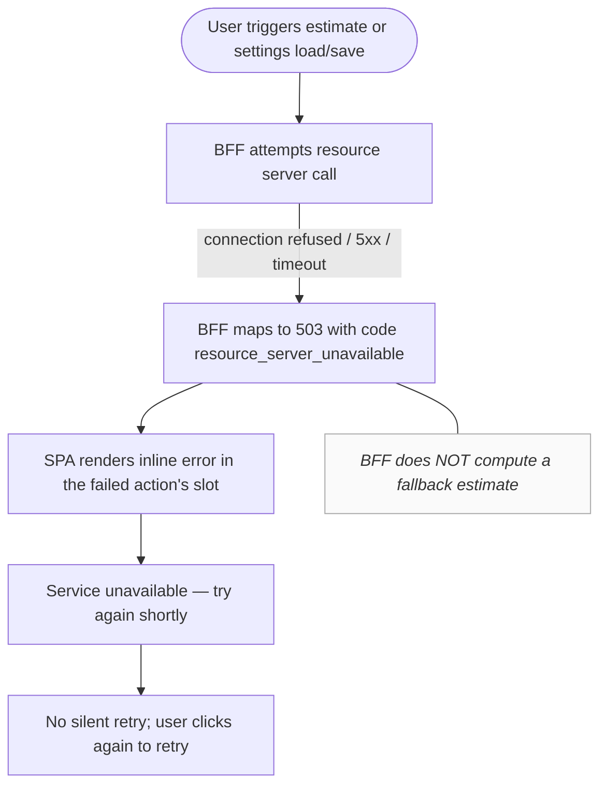

# UX Design Specification BMAD_books

**Author:** Nearformer
**Date:** 2026-05-14

---

## Executive Summary

### Project Vision

Reading Time Estimator is a deliberately thin personal reading-list SPA whose **primary purpose is architectural**: to serve as a working, reproducible reference for Authorization Code + PKCE with a confidential Token-Handler/BFF, a stateless JWT-protected resource server, OAuth scope enforcement, and `sub`-keyed identity propagation across independently-owned services. The book domain — title, page count, reading status, and a personal reading-speed-driven time estimate — exists to give the OAuth flow something meaningful to protect. UX decisions must serve that architectural focus: minimal, credible, and free of features that would dilute it.

### Target Users

A single role: **authenticated end user**. In practice this is one of two overlapping audiences:

- The course capstone evaluator and the internal team adopting this as an OAuth/OIDC reference, walking through the running system to verify the flow.
- A developer (the implementer themselves, or a teammate) using the running app to drive end-to-end tests of the journeys in PRD §10.

Both audiences are highly technical and run the app on a desktop browser. The SPA is presented as a real, if small, consumer reading-list app — auth is visible but not theatrical, and architectural detail is left to be inferred from code and observable behavior rather than surfaced as in-UI affordances.

### Key Design Challenges

- **Make the OAuth round-trip legible without theatricalizing it.** J1 (first-time login) and J5 (logout) are the marquee journeys. The redirect to the authorization server and the return must not feel like a silent flicker the evaluator misses, but the SPA must not narrate the flow with developer-style affordances either — the cue is a clean unauthenticated state, a clear "signed in as …" identity in the chrome after return, and an unambiguous logout that leaves the user provably re-protected.
- **Honor service seams without surfacing them as user confusion.** Book CRUD lives on the BFF; reading speed and estimate computation live on the resource server behind OAuth scopes. The user must never be told "this came from the resource server", but failure modes must remain service-shaped — most critically J6 (resource server unavailable), which the PRD requires the BFF to surface honestly rather than fabricate. The error state for J6 is a distinct, first-class UI state, not a generic toast.
- **Keep the domain minimal but credible.** Book CRUD with title, page count, and a three-value status (to-read / reading / finished), plus a separate settings view for reading speed, plus an on-demand estimate per book. No richer affordances — no tags, no sorting, no search, no bulk operations, no metadata enrichment. Enough to exercise the flow honestly; no more.
- **Session and identity must be unambiguously visible.** "Am I signed in? As whom? How do I sign out?" must be answerable at a glance at all times, because J5 ("logout and re-protection") and protected-route redirect behavior are part of what the system is being evaluated on.

### Design Opportunities

- **Scope boundaries as natural routing.** Putting reading speed on its own settings view (rather than inlined into the book list) makes the `reading-speed:read` vs `reading-speed:write` scope split fall out of the UX naturally, without the UI having to declare it.
- **Status transitions on books as the J2 demonstration vehicle.** A clearly affordable to-read → reading → finished progression makes the book-CRUD journey demonstrable end-to-end with a single book record, keeping seeded test data trivial.
- **Visual tone as a focusing device.** A plain functional UI — neutral typography, a single accent color, no logo or illustration work — keeps reviewer attention on the architecture. "Looks finished, isn't elaborate" is the target.

## Core User Experience

### Defining Experience

The defining interaction is **requesting a reading-time estimate for a book** (FR-ESTIMATE-01 / J3). It is the only action that exercises the full architectural surface — the SPA calls the BFF, the BFF calls the resource server with a scoped access token, the resource server reads the user's reading-speed record and computes against the book's page count, and the result comes back. The supporting loop is **book CRUD** (FR-BOOK-01 / J2): adding books, advancing their status (to-read → reading → finished), and eventually removing them. The settings view (FR-SPEED-01 / J4) is visited rarely, but it is what makes a second estimate request on the same book yield a different number — the proof that the resource server is doing the work.

### Platform Strategy

- **Single Page Application, desktop browsers only.** No responsive layout, no mobile viewport, no PWA, no offline mode. (PRD §4 non-goal, durable scope decision.)
- **Mouse/keyboard interaction.** No touch affordances.
- **Cookie-session client.** The SPA talks only to the BFF, authenticated by an HttpOnly session cookie set during OIDC callback. No tokens reach the browser. No browser storage of auth state.
- **No device-specific capabilities** to leverage or design around.
- **No accessibility hardening.** Reasonable default HTML semantics, but no WCAG conformance or assistive-technology consideration in this UX spec. (PRD §4 non-goal, durable scope decision.)

### Effortless Interactions

- **Login is one click and a redirect round-trip.** The SPA never asks for credentials. "Log in" → bounce to Keycloak → return signed in. Nothing else to learn.
- **Token refresh is invisible.** The user never sees a "your session is being renewed" affordance. The BFF refreshes and replays in flight; the SPA sees only the eventual response.
- **Adding a book is a single form.** Title + page count + status — three fields, one submit, no wizards, no modal stacks. New book appears in the list.
- **Requesting an estimate is a single button on a book row.** No confirmation, no parameter dialog. Loading state, then a number with a unit ("about 4 h 20 m"). One click, one answer.
- **Logout is one click and you are unambiguously logged out.** Identity chrome empties, the SPA returns to the unauthenticated landing state, and the refresh token is invalidated upstream — visiting a protected route bounces back through login.

### Critical Success Moments

- **First successful return from login (J1).** The user clicks "log in", goes through Keycloak, returns to the SPA — and at that instant their identity is plainly visible in the chrome and an (initially empty) book list is rendered. If this moment is ambiguous, the whole architectural demo is ambiguous.
- **First estimate (J3).** A user with at least one book and a reading speed on file clicks "estimate" and receives a sensible duration without delay or error. This is the moment the cross-service, scoped OAuth call quietly pays off.
- **Updated speed yields a different estimate (J4).** Settings → change reading speed → return to book list → request estimate on the same book → see a different number. Without this, the resource server's role is invisible.
- **Logout re-protects (J5).** Clicking logout returns the SPA to its unauthenticated state immediately, and attempting to reach a protected route redirects to login. If logout leaves residual access, the whole demo fails.
- **J6 error is distinct.** When the resource server is unavailable, the estimate action surfaces a specific, named error state ("Estimate service is unavailable — try again shortly") that is visually and textually different from a validation error or a transient toast. The BFF does not invent a number.

### Experience Principles

1. **The OAuth flow is the product.** Every UI decision is judged against whether it supports or obscures the architectural narrative. When a feature would dilute focus, it is cut.
2. **Effortless auth, visible identity.** Users never think about tokens, sessions, or scopes, but they always know who they are signed in as and how to sign out. Identity chrome is persistent and unambiguous on every protected view.
3. **One decision per screen.** A handful of focused views — landing/login, book list, single-book add/edit, settings, error — and no nested modals, tabs, or multi-pane dashboards. This serves both visual minimalism and end-to-end testability.
4. **Failures are honest.** Resource server unavailable surfaces honestly. Session lapsed redirects to login. The UI never fabricates results to hide a broken boundary, and never silently retries in ways that would mask the system from a reviewer.
5. **Minimal-but-credible domain.** The book UI feels like a real, small reading-list app — it does not look like a wireframe — but it never grows beyond what the J1–J6 journeys require. Sorting, tagging, search, bulk actions, and metadata enrichment are explicitly excluded.

## Desired Emotional Response

### Primary Emotional Goals

The dominant feeling target is **quiet confidence** — for both audience halves (the reviewer/evaluator and the developer-as-user). The reviewer should feel "yes, this is working correctly and I can see that it is"; the developer should feel "this stays out of my way." Explicitly, the goal is **not** delight, magic, surprise, or any of the consumer-app emotional vocabulary. A reading-list app demonstrating an OAuth flow gets emotional credit by being unobtrusive and predictable, not by being charming.

### Emotional Journey Mapping

- **Unauthenticated arrival.** Plain, low-stakes. A single visible action ("Log in"). No noise, no marketing. Feeling: *uncluttered, oriented.*
- **OAuth round-trip (J1).** A brief, transparent handoff to Keycloak and back. The redirect is short enough not to feel like an interruption, but visible enough that the user/reviewer registers what happened. Feeling: *expected, not surprising.*
- **First post-login view.** Identity clearly displayed in the chrome; the (likely empty) book list is the foreground. Feeling: *I am in the right place and I know who I am.*
- **Book CRUD.** Forms accept input without nags, status changes feel direct, deletions are immediate. Feeling: *responsive, in control.*
- **Estimate request (J3).** A single click, brief loading, then a number. No fanfare. Feeling: *answered.*
- **Settings change followed by re-estimate (J4).** Edit speed, save, re-request estimate, see a different number. Feeling: *the system is doing what I told it to.*
- **Resource server failure (J6).** Clear, named error state distinct from validation errors. Feeling: *the system told me the truth* — not anxiety, not blame.
- **Logout (J5).** Instant return to unauthenticated state. Feeling: *closed, clean.*
- **Return visit.** Identical login affordance, immediate continuity of book list after re-auth. Feeling: *predictable.*

### Micro-Emotions

The critical pairs for this product, in order of importance:

- **Confidence vs. Confusion** — non-negotiable: identity, auth state, and transitions must never leave the user uncertain. This is the headline emotion.
- **Trust vs. Skepticism** — the J6 honest-failure behavior is the chief trust signal. A fabricated estimate would permanently break trust in the system.
- **Accomplishment vs. Frustration** — minor for routine actions, central for the J4 "I changed my speed and now my estimate changed" moment.
- **Satisfaction vs. Delight** — we are deliberately targeting *satisfaction* (it worked, as expected) and explicitly **not** delight (an unexpected pleasure). Delight here would suggest the app is the point, which it is not.

Pairs not in scope: belonging vs. isolation (no social surface), excitement vs. anxiety (no high-stakes actions), creativity vs. constraint (no creative tooling).

### Design Implications

- **Confidence → persistent identity chrome.** "Signed in as …" + a logout control visible on every protected view, not buried in a menu. Returning from OAuth places that chrome immediately.
- **Confidence → unambiguous auth-state transitions.** Logout empties the chrome and re-renders the unauthenticated view in the same paint cycle; no in-between "logging you out" splash that could leave doubt.
- **Trust → distinct error states, not toasts.** J6's "estimate service unavailable" is rendered in the book row where the estimate would have appeared, with explicit language ("Service unavailable — try again shortly"). Not a generic toast that disappears, not a "something went wrong" placeholder.
- **Trust → no silent retries with hidden state.** If the BFF refreshes a token mid-request, that is invisible by design; but no other class of failure is silently swallowed.
- **Accomplishment (J4) → strong visual diff on re-estimate.** When the same book yields a different estimate after a settings change, the new value is rendered clearly and replaces the old (no "previously…" callouts needed — the change is the message).
- **Satisfaction-not-delight → no easter eggs, no animations beyond functional state transitions, no celebratory affordances.** Empty state for the book list is a single instructional sentence, not an illustration.

### Emotional Design Principles

1. **Predictable over surprising.** Every interaction should feel exactly the way the user expected it to feel before they clicked. Surprise is a bug.
2. **Honest over flattering.** When something fails, the UI says so plainly, in language a developer would write for another developer. We do not soften failure with mascots or apologies.
3. **Quiet over expressive.** No animations, illustrations, micro-interactions, or copy that would draw attention away from the act of using the app. The product's tone is "small useful tool", not "warm friendly companion."
4. **Continuous over fragmented.** State transitions (login return, logout, status changes, estimate updates) happen in-place and immediately, never via splash screens or interstitial states that fragment the user's sense of "where I am."

## UX Pattern Analysis & Inspiration

### Pattern Categories Referenced

This UX spec deliberately avoids grounding in specific named products and instead draws from three pattern *categories* whose shared characteristics fit this project's character:

- **Minimal authenticated CRUD interfaces** — tools where a small data model (rows with a few fields) is owned by an authenticated user. The relevant trait is restraint: no marketing surface, no onboarding tour, no empty-state illustration. The login boundary is plain; the data surface is plainer.
- **Developer-tooling settings pages** — small forms for configuring a per-user value, accessed infrequently, exposed via a single named link in the top chrome. The relevant trait is that settings is its own route, not a slide-over panel or inline editor — which aligns naturally with our `reading-speed:write` scope boundary.
- **Honest infrastructure error rendering** — error patterns from systems whose audience is technical users and whose failure modes are real. The relevant trait is naming the failure precisely (which service, what state) instead of softening it into a generic "something went wrong."

### Transferable UX Patterns

**Navigation patterns:**

- **Persistent top chrome with identity + logout.** A single horizontal bar on every protected view holding the product name on the left and "Signed in as `<sub or preferred_username>` · Log out" on the right. No hamburgers, no profile drop-downs, no nested account menus — the chrome contains exactly the auth-state affordances and nothing else.
- **Two-route protected surface.** `/books` (the list) and `/settings` (reading speed). One link between them, in the top chrome. No left-rail navigation, no breadcrumbs, no tabs within views.
- **Login as a route, not a modal.** `/login` is a dedicated unauthenticated view with a single button. Protected routes hit while unauthenticated redirect there. The OAuth bounce leaves the SPA entirely; there is no "login modal" pattern.

**Interaction patterns:**

- **Inline row actions for the dominant verb.** Each book row carries a "Estimate" button as its primary affordance, with a secondary edit/delete control set. Estimate result renders in the same row, replacing or extending the row's right-hand cell. No detail page for a book.
- **Status as a three-state pill.** Reading status is a single control on the row (to-read / reading / finished) — a segmented control or a dropdown, not three checkboxes and not a free-form text field. Status changes are immediate (PATCH on selection), not gated behind a "save" button.
- **Single-form create.** Adding a book is a small inline form at the top of the list (title, page count, status, submit) — not a modal, not a separate `/books/new` route. The same form is reused for edit-in-place.
- **Save-on-blur or explicit-save for settings.** The settings view's reading-speed field uses an explicit "Save" button so the `reading-speed:write` request is a clear, single user action — making the scope boundary visible to anyone observing the network.

**Visual patterns:**

- **Plain typographic hierarchy.** A single sans-serif type stack, one accent color reserved for primary actions and the active state, otherwise neutral grays. No card shadows, no rounded badges, no gradients.
- **Empty state as a single instructional sentence.** When the book list is empty post-login, render "No books yet. Add one above." No illustration, no call-to-action button beyond the existing form.
- **Loading state as inline text or button-disabled.** A button switches to "Estimating…" disabled during the estimate request; the row does not get a spinner. No global progress indicators, no skeleton loaders.
- **Error state in the slot where the answer would have appeared.** A J6 failure renders, in the row's estimate cell, the literal text "Service unavailable — try again shortly" in the accent error color. Not a toast, not a banner.

### Anti-Patterns to Avoid

- **Hiding auth state behind a menu.** "Click your avatar → log out" is forbidden here. Logout is a first-class, always-visible affordance because J5's re-protection is part of what's being demonstrated.
- **Onboarding tours, welcome modals, or empty-state CTAs that overshadow the actual form.** The book list post-login does not greet, congratulate, or guide; the form is already there.
- **Generic "Oops, something went wrong" error rendering.** This collapses J6's distinct, infrastructure-truthful failure into a normal-looking transient error. Forbidden.
- **Optimistic UI that hides cross-service failure.** If the estimate request fails, the row must show the failure, not pretend to have an answer while a background retry happens. Optimistic UI is acceptable only for status changes on the book list (BFF round-trip, single service, low stakes).
- **Decorative motion or transitions.** Fade-ins, slide-overs, route transition animations — all forbidden. State changes must be instantaneous to preserve the "continuous over fragmented" emotional principle.
- **Combined settings/profile/account menus.** No account-management surface beyond the explicit logout control and the reading-speed setting. No "delete my account," no "change email," no "billing." There is no user table on the BFF or resource server; treating identity as something the SPA can edit would be architecturally false.
- **In-app login forms.** The SPA never renders username/password fields. Login happens only at the authorization server.

### Design Inspiration Strategy

- **Adopt without modification:** persistent identity chrome with always-visible logout; inline-row primary action; two-route protected surface; plain typographic hierarchy; in-place error rendering at the site of the failed action.
- **Adapt:** the minimal-CRUD pattern of inline create-form-at-top-of-list (adopted), but with an explicit small heading above the list rather than a borderless form, so a reviewer scanning the page can locate the "add" affordance immediately without keyboard focus.
- **Avoid wholesale:** any consumer-product pattern that draws emotional attention (illustrations, motion, copywriting voice, achievement affordances), and any developer-tooling pattern that *over*-exposes architecture (token inspectors, scope panels, "debug" toggles). This UX is for the running app's end-user surface, not for the diagnostic surface; the architectural visibility lives in the code and in network observability, not in the UI.

## Design System Foundation

### Design System Choice

**Recommendation: utility CSS (Tailwind CSS) + standard semantic HTML controls, with no opinionated component library.** A small handwritten set of project-specific components (`TopChrome`, `BookRow`, `BookForm`, `EstimateCell`, `ErrorCell`) provides the only abstraction. The "system" is essentially a single sheet of design tokens — accent color, neutral grays, type scale, spacing scale — plus a short list of conventions for using them.

**Acceptable substitute:** vanilla CSS with a small set of CSS custom properties for tokens, if even Tailwind feels like overhead for the surface area. Both choices satisfy the UX constraints; the architect can pick on implementation-ergonomics grounds.

**Explicitly rejected:** opinionated component libraries (Material UI, Ant Design, Chakra UI, Mantine, etc.). Each carries a visual signature that would compete with the "plain functional UI" principle, and the features that justify their weight — deep theming, broad component sets, accessibility primitives, responsive grids — are all things this project does not need.

### Rationale for Selection

- **Matches the "plain functional UI" tone (UX §2).** Utility CSS leaves visual identity to the small handful of decisions encoded in the token sheet, rather than inheriting a brand from a component vendor.
- **Honors the PRD's out-of-scope list.** Accessibility hardening and responsive layouts are explicitly excluded (PRD §4); a component library whose main selling points are those concerns would be paying for unused features.
- **Doesn't compete with the architectural narrative.** A heavyweight design system on a tiny CRUD surface is the visual equivalent of fabricating an estimate — it signals more product polish than the project is actually claiming. Utility CSS keeps the UI honestly proportional to the domain.
- **Trivially scoped to ~6 components.** The full SPA surface fits in a handful of focused components; a component library's economy-of-scale argument does not apply.
- **No version-lock liability.** No design-system upgrade path to maintain over the lifetime of this reference; the visual choices live in one short stylesheet/token file the team owns.

### Implementation Approach

- **Design tokens as the single source of truth.** A short file (CSS custom properties, or `tailwind.config.js` theme block) defines: one accent color, one error color, a 5-step neutral gray ramp, a 4-step type scale, a 4-step spacing scale. No semantic color naming beyond `accent` / `error` / `text` / `text-muted` / `surface` / `border`.
- **Project components, not generic ones.** Build the small, named set that maps to the UI surface — `TopChrome`, `BookList`, `BookRow`, `BookForm`, `EstimateCell`, `StatusControl`, `ErrorCell`, `LoginView`, `SettingsView` — rather than a generic `Button`/`Input`/`Modal` kit. These components encode the patterns from UX §5 ("Transferable UX Patterns") directly.
- **HTML controls without replacement.** Native `<input>`, `<select>`, `<button>`, `<form>`. No custom-rendered dropdowns or segmented controls; the reading-status control may use a `<select>` or a small group of `<button>` toggles, both of which are native.
- **No icon library.** Text labels everywhere ("Log out", "Estimate", "Delete"). If an icon is unavoidable later, a single inline SVG, not an icon font.
- **No state management library for design concerns.** Loading and error state live in the component that owns the request; no global UI store.

### Customization Strategy

- **Single accent color, chosen at implementation time.** The architect/implementer picks one accent (e.g., a muted blue or teal) — the UX spec does not prescribe a specific hex value. Constraint: must have sufficient contrast against the neutral background for clear button affordance, and must be visibly different from the error color.
- **No theming, no light/dark toggle.** A single visual mode. (A dark-mode toggle would be a feature whose maintenance argues against the "no scope creep" principle.)
- **No brand customization layer.** There is no brand to express. The product name in the chrome is rendered in the same type stack as the rest of the UI.
- **Tokens are stable, components are project-internal.** Once tokens are set, they are not parameterized further. Components do not accept theme props; they read directly from token CSS variables. This keeps the "system" small enough to fit in one developer's head.

## Defining Experience: Detailed Mechanics

### Defining Interaction

The defining interaction — restated from §"Core User Experience" with the additional detail this section requires — is **clicking "Estimate" on a book row and seeing a reading-time duration appear in its place**. Everything architectural about this project — the BFF brokering a scoped, JWT-bearing cross-service call to a stateless resource server that reads the user's reading-speed record from its own storage — is in service of this one button. If a user can do this in a single click, get an answer they recognize as correct, see the answer change after updating their reading speed, and see an honest distinct failure when the resource server is down, the product has succeeded.

This is the *only* defining interaction. Book CRUD, status changes, and login/logout are supporting infrastructure — fine to be utilitarian, fine to be unremarkable.

### User Mental Model

Users approach this interaction with a calculator-like mental model: "I told the system how fast I read; ask it how long this book will take." Concretely:

- **They expect a duration, not a date.** "About 4 hours 20 minutes," not "you'll finish on Tuesday." A duration is invariant to time-of-day and weekly schedule; turning it into a calendar prediction would invite questions the system cannot answer.
- **They expect the answer to change when their speed changes.** This is the explicit J4 demonstration. The mental model is not "the system has computed and cached an estimate"; it is "the system computes on demand from current inputs."
- **They do not expect permission negotiation.** They do not think "do I have scope to read my own reading speed?" Scope-denial UX is therefore a 500-class error case from the user's perspective, not a normal flow.
- **They do not think about which service answered.** "The app told me four hours" — that the answer crossed a service boundary is invisible by intent. The user mental model is single-system; only the failure-mode UX (J6) hints otherwise, and only because the truth requires it.
- **Likely confusion point: missing reading-speed value.** A first-time user who has not yet visited settings has no reading speed on file. Their expectation is that clicking "Estimate" will work. We must either seed a sensible default at login, or surface a specific, actionable message ("Set your reading speed in Settings to enable estimates") with a link — never a generic 400.

### Success Criteria

The interaction is successful when **all** of these hold on a single click:

- The transition from button → result happens in under ~500ms for a warm system (under ~1s cold). Above that, the user begins to wonder whether it worked.
- The result renders in the same row, in the same cell where the button was, with no layout shift elsewhere on the page.
- The result is recognizable as a duration with a unit (e.g., "≈ 4 h 20 m" or "≈ 12 m" or "≈ 1 d 2 h" for very long books) — not raw minutes ("260"), not a decimal hours ("4.33"), not an unannotated number.
- After updating the reading speed in settings and returning to the book list, clicking "Re-estimate" on the same book yields a different, sensible result. The new value replaces the old in-place.
- On J6 (resource server unavailable), the cell renders a named, specific failure that the user can distinguish from a permissions error or a validation error.

### Novel vs. Established Patterns

This is an **entirely established pattern** — on-demand compute from stored settings + per-record input is the same shape as any calculator, search, or "calculate" affordance in any settings-driven tool. We adopt it without modification or innovation.

The novelty in this project is **architectural, not interactional**. The estimate's defining trait from a UX perspective is its calm familiarity, not its inventiveness. A novel interaction would obscure the architectural narrative by drawing attention to itself; a familiar interaction lets the architecture be the thing under examination.

### Experience Mechanics

**1. Initiation.** Each book row in the list carries an "Estimate" button in its right-most cell. The button is the row's primary affordance, visually distinguished from the secondary edit/delete controls. No precondition gating — even if reading speed is unset, the button is enabled (we will explain the missing precondition in the response, not by greying out the control).

**2. Interaction.** User clicks "Estimate." The button immediately transitions to a disabled state with label "Estimating…" (text-only, no spinner — see Design System §"Implementation Approach"). The SPA fires `POST /api/books/{id}/estimate` (or equivalent) against the BFF. The BFF, on behalf of the user, calls the resource server with the user's access token and the book's page count, the resource server reads the user's `reading-speed` record, computes the duration, and returns it. The BFF forwards the result to the SPA. Token refresh, if needed, happens entirely inside the BFF without any SPA-visible affordance.

**3. Feedback.**

- **Success:** the right-most cell replaces the "Estimate" button with the formatted duration text (e.g., "≈ 4 h 20 m"). Adjacent to the duration is a small text affordance "Re-estimate" that re-runs the request on click.
- **Missing reading speed (precondition failure):** the right-most cell renders an inline message: "Set your reading speed in Settings to enable estimates," with "Settings" as a link to `/settings`. The button restores to its initial state for retry after the user has set their speed.
- **Resource server unavailable (J6):** the right-most cell renders "Service unavailable — try again shortly" in the error accent color. The button restores to its initial state. No retry is performed silently.
- **Other unexpected failure (5xx, network error):** the cell renders a generic "Couldn't get an estimate — try again" message in the error accent color. The button restores. This case should be rare; the J6 case is the one we surface specifically.

**4. Completion.** The duration remains visible on the row indefinitely — it is not a transient toast and does not expire on a timer. The user knows they are done when the duration is visible. The expected next action is either: (a) request an estimate on a different book, (b) advance the current book's status (e.g., to-read → reading), or (c) leave the page. After a settings change, the visible duration is stale by intent — the user must click "Re-estimate" to refresh it. We do not auto-invalidate; that would violate the "predictable over surprising" principle.

## Visual Design Foundation

### Color System

No existing brand guidelines apply. The system uses a small, semantically named palette with one accent for primary affordances and one error color for failures. All values are starting points the implementer can adjust as long as the *intent* and *contrast guidance* in each entry are preserved.

**Tokens (recommended starting values, light mode only):**

| Token | Role | Suggested value | Constraint |
|---|---|---|---|
| `--color-surface` | Page background | `#FFFFFF` | Pure white acceptable; a very pale gray (e.g., `#FAFAFA`) also acceptable |
| `--color-surface-muted` | Subtle row striping, settings card | `#F5F5F5` | Must read as "same surface, slightly recessed" against `--color-surface` |
| `--color-border` | Row separators, input borders | `#E5E5E5` | Visible but quiet against `--color-surface` |
| `--color-text` | Body text, headings | `#111111` | High contrast against `--color-surface` |
| `--color-text-muted` | Secondary labels, empty-state copy | `#666666` | Readable but visibly secondary against `--color-text` |
| `--color-accent` | Primary buttons, active state, links | `#2563EB` (muted blue) | Implementer may substitute any single hue with similar visual weight; must be visually distinct from `--color-error` |
| `--color-accent-hover` | Hover state of accent surfaces | `#1D4ED8` | A perceptibly darker step of `--color-accent` |
| `--color-error` | J6/failure-state text, error inline messages | `#B91C1C` (muted red) | Must be visually distinct from `--color-accent`; tested side-by-side at small text sizes |

**Rules of use:**

- One accent. The accent color is used only for primary affordances (e.g., the "Estimate" and "Add book" buttons, the active state of the status control) and for inline links to other routes (e.g., "Set your reading speed in **Settings**"). It is not used decoratively.
- One error color. Error color is used only for failure-state text (e.g., "Service unavailable — try again shortly"). It is not used for destructive-action buttons (delete uses neutral styling — confirmation is via a native `confirm()` or a small inline confirm state, not by coloring the button red).
- No additional semantic colors. There is no success color, no warning color, no info color. This product has no surface for those states.

### Typography System

**Type family (single stack, system fonts only):**

```
-apple-system, BlinkMacSystemFont, "Segoe UI", Roboto,
"Helvetica Neue", Arial, sans-serif
```

No webfont loading. System sans-serif is sufficient for the project's "plain functional UI" tone and avoids the network cost / flash-of-unstyled-text complexity that no other constraint justifies.

**Type scale (4 steps):**

| Token | Role | Size / line-height | Weight |
|---|---|---|---|
| `--text-page-title` | Page title (e.g., "Books", "Settings") | 24px / 32px | 600 |
| `--text-section` | Section heading within a page (rarely needed) | 18px / 24px | 600 |
| `--text-body` | All body text, table rows, form fields, button labels | 14px / 20px | 400 |
| `--text-small` | Helper text, empty-state instructions, inline error messages | 12px / 16px | 400 |

**Conventions:**

- Numbers in the duration result use the same body type as surrounding text — no tabular-figures styling, no monospace, no enlarged display number. The result is information, not a headline.
- "Signed in as `<sub or preferred_username>`" in the top chrome uses `--text-body` with the username rendered in `--color-text` and the leading "Signed in as" in `--color-text-muted`.
- Form labels use `--text-body` `--color-text`. Helper text below an input uses `--text-small` `--color-text-muted`.

### Spacing & Layout Foundation

**Base unit:** 4px. Spacing tokens used in the system:

| Token | Value | Use |
|---|---|---|
| `--space-1` | 4px | Inline tight spacing (between an icon-less label and an adjacent control) |
| `--space-2` | 8px | Padding inside compact controls (button vertical), gap between form fields in a row |
| `--space-3` | 12px | Padding inside book rows, vertical rhythm between paragraph and form |
| `--space-4` | 16px | Page-level horizontal padding inside the content frame, default vertical gap between sections |
| `--space-6` | 24px | Vertical rhythm between major sections (e.g., the add-book form and the book list) |
| `--space-8` | 32px | Page top/bottom padding |

**Layout structure:**

- A single centered content column constrained to a max width of `720px`. The column has horizontal padding (`--space-4`) and vertical padding (`--space-8`).
- The top chrome is a thin (height ~48px) bar spanning the full viewport width, with the content column's horizontal padding mirrored. Its content (product name on the left, identity + logout on the right) sits on a single line.
- No grid system beyond the single-column flow. Rows in the book list are flex containers; the form fields above use a single column of stacked fields with a horizontal row for action buttons.
- No multi-column layouts anywhere. No sidebars, no two-pane views. The desktop-only constraint does not require us to *use* the extra width — the 720px column is intentional restraint.

**Density:** moderate. Forms and book rows are not maximally dense (no spreadsheet-style tight rows), but the page is not airy either. Aim for "useful tool" density, not "marketing page" airiness.

### Accessibility Considerations

**Accessibility hardening is explicitly out of scope** for this project per PRD §4 (no WCAG conformance audit, no assistive-technology testing, no a11y-focused UX work). The implementer should not budget time for a screen-reader pass, keyboard-only flow verification, ARIA roles beyond what semantic HTML provides natively, focus-trap implementation, or contrast-ratio auditing.

That said, the system avoids gratuitously hostile choices as a byproduct of using semantic HTML:

- All interactive elements are native (`<button>`, `<a>`, `<input>`, `<select>`, `<form>`), inheriting default keyboard and focus behavior.
- Form fields have associated `<label>` elements (a default of writing forms correctly, not an a11y commitment).
- The color choices above provide adequate contrast for typical sighted users on a typical monitor; this is not a WCAG claim and has not been audited.

This section is included to make the scope decision unambiguous to a reviewer, not to suggest accessibility work was performed.

## Design Direction Decision

### Design Directions Explored

No alternative design directions were explored in this step. The "plain functional UI" tone (UX §"Executive Summary"), the rejection of opinionated component libraries (UX §"Design System Foundation"), and the single-accent / single-type-stack token system (UX §"Visual Design Foundation") together specify a single visual direction tightly enough that exploring 6–8 variants would have produced near-identical mockups. Variation in this step was deferred to the implementer's discretion within the constraints already established.

### Chosen Direction

The chosen direction is the one already specified by the preceding sections:

- A single centered 720px content column on a near-white surface.
- A thin top chrome with product name on the left, "Signed in as `<sub>` · Log out" on the right.
- A `/books` view dominated by an add-book form at the top and a flat list of book rows below; each row contains title, page count, status control, the "Estimate" affordance, and secondary edit/delete controls.
- A `/settings` view containing a single labelled input (reading speed) with an explicit "Save" button.
- A `/login` view containing one button and a brief instruction.
- An error state for J6 rendered in the estimate cell of the affected row, in the error accent color, with the literal text "Service unavailable — try again shortly."

No card surfaces, no shadows, no rounded badges, no icons, no animations, no marketing-style hero areas, no left rail.

### Design Rationale

- **One direction, not many, is consistent with the product's character.** This UX exists to demonstrate an OAuth architecture; visual exploration is not part of the demonstration. Locking the direction up front prevents the design surface from absorbing implementation attention better spent on the auth flow.
- **The chosen direction is maximally restrained.** Every visual decision was the smaller, quieter option. This serves the "quiet competence" emotional target and the "plain functional UI" tone.
- **Decisions deferred to the implementer are bounded.** The implementer chooses the specific accent hex (within constraints), the spacing of certain optional polish (e.g., row hover state), and small layout details (e.g., gap between input and label). They do not choose the visual language.

### Implementation Approach

- **The implementer renders this direction directly from the tokens and rules defined in UX §"Visual Design Foundation" and the component conventions in §"Design System Foundation".** No mood board, no Figma file, no style guide beyond what is already in this document.
- **Deviations from the locked direction require a documented reason.** If during implementation the developer discovers that a token value or a layout rule produces an unworkable result (e.g., the 720px column is too narrow for a particular row layout), the deviation is recorded in the architecture document or the relevant story, not silently absorbed.
- **No further mockup pass is planned.** The next step in the workflow detail user journeys, components, and patterns — narrative refinements of this same direction.

## User Journey Flows

Each of the six PRD journeys is rendered below as a UI-mechanic flow. Diagrams use Mermaid; sequence diagrams are used where multiple services exchange (J1, J5), and flowcharts are used where the path is contained to the SPA + BFF.

### J1. First-time login

**Entry:** User loads the SPA (any URL) without a valid session cookie.

**Flow:**



**Success state:** identity is visible in the top chrome; the (initially empty) book list is rendered with the inline instructional empty state.

**Failure recovery:** if the token exchange fails, the BFF redirects to `/login?error=auth` and the login view renders a small inline message: "Login didn't complete — try again." No technical detail, no retry button beyond the existing "Log in" button.

### J2. Manage books (CRUD)

**Entry:** User on `/books` view, authenticated.



**Success states:**
- Add: new row at top of list, form clears.
- Status change: control updates immediately; no toast.
- Edit: row returns to display mode with updated fields.
- Delete: row is removed from the list.

**Failure recovery:** all failures render inline at the location of the action; no global toast, no full-page error.

### J3. Request reading-time estimate

**Entry:** User on `/books` with at least one book row.

```mermaid
flowchart TD
    Click([Click "Estimate" on row]) --> Disable[Button → "Estimating…" disabled]
    Disable --> Req[POST /api/books/:id/estimate]
    Req -->|2xx duration| Result[Render duration in cell; show "Re-estimate"]
    Req -->|412 precondition: no reading speed| Precondition[Render: "Set your reading speed in Settings"]
    Precondition --> SettingsLink[Link to /settings]
    Req -->|503 resource server unavailable| J6Err[Render error: "Service unavailable — try again shortly"]
    Req -->|other 4xx/5xx| GenericErr[Render: "Couldn't get an estimate — try again"]

    Result -->|click Re-estimate| Disable
    Precondition -->|user returns from settings, clicks Estimate again| Disable
    J6Err -->|click Estimate again| Disable
    GenericErr -->|click Estimate again| Disable
```

**Success state:** the row's right-most cell shows a duration with unit (e.g., `≈ 4 h 20 m`) and a "Re-estimate" affordance.

**Failure recovery:** all failure paths surface in the same cell, never as a global toast. The button restores to its initial state in all failure cases.

### J4. Adjust reading speed

**Entry:** User clicks "Settings" link in top chrome (or navigates directly to `/settings`).

```mermaid
flowchart TD
    Nav([Navigate to /settings]) --> Get[GET /api/reading-speed]
    Get -->|2xx value| Show[Settings form shows current value]
    Get -->|404 no value yet| Empty[Settings form shows empty value, helper text: "Pages per hour, e.g., 30"]
    Get -->|503| Unavail[Inline error: "Service unavailable — try again shortly"]

    Show --> Edit
    Empty --> Edit
    Edit[User edits the value]
    Edit -->|click Save| Put[PUT /api/reading-speed]
    Put -->|2xx| Saved[Button label briefly switches to "Saved"; new value persists in form]
    Put -->|4xx validation| Invalid[Inline error under input: "Enter a positive number"]
    Put -->|503| SaveUnavail[Inline error under input: "Service unavailable — try again shortly"]

    Saved --> Back([User navigates back to /books])
    Back --> Reestimate([Clicks "Re-estimate" on a book]) --> J3[See J3 flow with updated value]
```

**Success state:** the reading speed value is shown in the form, and subsequent estimates use the new value.

**Failure recovery:** validation errors render inline under the input; service-unavailable renders inline under the input in the error color; nothing navigates the user away from the form.

### J5. Logout and re-protection

**Entry:** Authenticated user on any protected route clicks "Log out" in the top chrome.

```mermaid
sequenceDiagram
    participant U as User
    participant SPA as SPA
    participant BFF as BFF
    participant AS as Authorization Server

    U->>SPA: click "Log out"
    SPA->>BFF: POST /auth/logout
    BFF->>AS: revoke refresh_token (or end_session_endpoint)
    AS-->>BFF: 200
    BFF->>BFF: clear server-side session + invalidate cookie
    BFF-->>SPA: 204 + Set-Cookie clear
    SPA->>SPA: navigate /login; clear in-memory user state
    SPA-->>U: render unauthenticated /login

    Note over U,SPA: Re-protection check
    U->>SPA: navigate /books
    SPA->>BFF: GET /api/me
    BFF-->>SPA: 401
    SPA->>SPA: navigate /login
```

**Success state:** the top chrome's identity area is empty, only the product name remains. The `/login` view is rendered. Any subsequent attempt to load a protected route bounces back to `/login`.

**Failure recovery:** if AS revocation fails, the BFF still clears its local session and returns success to the SPA — the user is logged out from this client regardless. This is a deliberate choice: a half-logged-out state would violate the "honest over flattering" principle.

### J6. Resource server unavailable

**Entry:** User performs any action that requires the resource server (estimate request, settings load/save) while the resource server is down or returning 5xx.



**Success state:** there is no success state for J6 — the success state is observing the *correct* failure surface.

**Failure recovery:** the user retries by clicking the action again. The BFF does not silently retry; it does not fabricate a result. The SPA does not auto-poll.

### Journey Patterns

Across the six flows, the same three patterns recur:

- **Inline error rendering at the action site.** Every failure renders in the same UI region the user was looking at when they triggered the action — in the row cell, under the form field, or in the chrome's identity area for auth failures. No global toasts, no full-page error pages except for hard-routing fallbacks (e.g., a 404 page for non-existent routes).
- **Optimistic UI for same-service, low-stakes changes; pessimistic for cross-service.** Status changes on a book row (BFF-only) update optimistically and revert on failure. Estimate requests (cross-service, scope-gated) are pessimistic — the button stays disabled until the round-trip completes.
- **Failure shapes mirror service boundaries.** A 503 originating from the resource server's unavailability surfaces as a distinctly different UI state than a 4xx validation error or a 401 session expiry. The user is not asked to understand this; the *implementer* is asked to preserve the distinction.

### Flow Optimization Principles

- **Steps-to-success is already minimal** because the product surface is intentionally thin. The optimization opportunity is not "remove steps" — it is "preserve clarity at each existing step."
- **Cognitive load is minimized by hiding architecture, not by hiding errors.** Token refresh is invisible; scope is invisible; service split is invisible — but every failure that the user encounters is named, located, and (where appropriate) actionable.
- **Recovery defaults to retry-in-place.** Most failures expose a button or affordance the user can click again from the same context. No flow forces the user to leave the page and start over.
- **No silent retries on cross-service failure.** A retry would mask the boundary the project is meant to demonstrate, and would risk hiding sustained outages from view.

## Component Strategy

### Design System Components

The project does not adopt an external component library. The "design system" is the token set defined in §"Visual Design Foundation". All UI elements are either native HTML controls (`<button>`, `<input>`, `<select>`, `<form>`, `<a>`) styled via the token set, or one of the project components specified below.

There is deliberately no shared `Button`, `Input`, `Modal`, `Toast`, or `Card` component. Native controls are styled directly via utility classes or scoped CSS reading from token CSS variables; the abstraction layer is the project-specific component, not a generic primitive kit. This keeps the abstraction surface tightly scoped to the views the product actually needs.

### Custom Components

Components are listed below in the order they appear in user journeys. Each spec covers purpose, anatomy, states, and interaction behavior. Visual styling is governed by the tokens from §"Visual Design Foundation"; component specs do not redefine colors, type sizes, or spacing values.

#### TopChrome

- **Purpose:** Persistent header rendered on every authenticated view. Holds product identity and the user's auth-state affordances.
- **Anatomy:** A horizontal bar (~48px tall) spanning the viewport. Left: product name (text only, `--text-page-title` weight). Right: identity block — `Signed in as <preferred_username or sub>` followed by a `·` separator and a "Log out" text button. A `Settings` link sits between the product name and the identity block when on `/books`; on `/settings` the link is replaced by a `Books` link.
- **States:** Authenticated (identity block visible) and unauthenticated (identity block absent; product name only). No hover state on the bar itself.
- **Interaction behavior:** "Log out" triggers the J5 flow; the route link navigates between `/books` and `/settings`. The component does not own its own data — it receives `{ user }` as a prop or reads it from a top-level auth context.

#### LoginView

- **Purpose:** The unauthenticated landing view at `/login`. Single-purpose: initiate the OAuth flow.
- **Anatomy:** Centered in the content column. A short headline ("Sign in to Reading Time Estimator" — adjustable), one paragraph of instructional copy ("You'll be redirected to authenticate, then returned here."), and a single "Log in" button. Optional small inline error message above the button when `?error=auth` is present in the URL.
- **States:** Default; error (rendered when login round-trip failed previously).
- **Interaction behavior:** Clicking "Log in" navigates the browser to `/auth/login` (BFF), beginning the J1 flow.

#### BookForm

- **Purpose:** Capture or edit a book's three fields (title, page count, status). Used in two contexts: the always-present add-book form at the top of `/books`, and an inline edit form that temporarily replaces a `BookRow`.
- **Anatomy:** Three input rows stacked: title (text input), page count (number input, min 1), status (StatusControl, default `to-read`). Submit row below: primary button ("Add book" or "Save"), and in edit mode a secondary "Cancel" text button.
- **States:** Idle; submitting (button label `Adding…` / `Saving…`, disabled); error (inline error message below the form preserving entered values).
- **Variants:** `add` (form is permanent, clears on success) and `edit` (form temporarily replaces a row, dismisses on success).
- **Interaction behavior:** Submit triggers a POST (add) or PATCH (edit) to the BFF. Validation is minimal — required fields, positive integer page count — and runs on submit, not on blur.

#### BookList

- **Purpose:** Container for the user's books. Renders the empty state when there are none, and a vertical list of `BookRow` instances otherwise.
- **Anatomy:** Section heading "Books" (`--text-page-title`), followed either by the empty-state copy or by a vertically stacked set of `BookRow` instances separated by 1px borders.
- **States:** Loading (initial fetch in flight — renders a single line of `--text-small` `--color-text-muted` copy: "Loading…"); empty (post-load, no books — renders the empty-state copy: "No books yet. Add one above."); populated; load-error (renders inline error: "Couldn't load books — refresh to try again.").
- **Interaction behavior:** None directly; delegates to its children.

#### BookRow

- **Purpose:** Display and act on a single book.
- **Anatomy:** A flex row containing: title (left, primary text), page count (`<n> pages`, muted), `StatusControl`, `EstimateCell`, and a secondary action group with text buttons "Edit" and "Delete".
- **States:** Default; hover (subtle background tint using `--color-surface-muted`); edit mode (the row is replaced by a `BookForm[variant=edit]`); status-changing (status control momentarily disabled during PATCH); deleting (row briefly disabled while DELETE is in flight, then removed); inline error (a single line of `--text-small` `--color-error` copy below the row's normal content when an action on the row fails).
- **Interaction behavior:** Edit toggles into the form; Delete fires a native `confirm()` then DELETE; status changes are optimistic per J2 flow; estimate is handled by `EstimateCell`.

#### StatusControl

- **Purpose:** Read and change a book's reading status. Three values: `to-read`, `reading`, `finished`.
- **Anatomy:** A native `<select>` styled to match the row's visual rhythm. Acceptable substitute: a three-button segmented control built from `<button>` elements. The choice is left to the implementer; both satisfy the "native controls" rule from §"Implementation Approach".
- **States:** Default; disabled (during in-flight PATCH); error (the control reverts to its prior value and a row-level error renders below).
- **Interaction behavior:** Change fires PATCH `/api/books/:id` with optimistic UI update; on failure, revert to prior value and render error.

#### EstimateCell

- **Purpose:** Hold the right-most cell of a `BookRow`. Renders the "Estimate" affordance, the resulting duration, or a failure state.
- **Anatomy:** A small container with one of four contents at a time: (1) the "Estimate" button; (2) "Estimating…" disabled state; (3) the duration text + a small "Re-estimate" affordance; (4) an `ErrorMessage` with one of the failure copy strings.
- **States:** Idle (button); loading; success (duration + re-estimate); precondition-failure (missing reading speed — message with link to `/settings`); service-unavailable (J6 — "Service unavailable — try again shortly" in error color); generic-failure ("Couldn't get an estimate — try again" in error color).
- **Interaction behavior:** Click on the button (in any state where it is visible) triggers POST `/api/books/:id/estimate`. Re-estimate clicks the same path. Success replaces button with the duration in-place; failures replace the button with the corresponding `ErrorMessage` and restore the button beneath for retry.

#### SettingsView

- **Purpose:** The single view at `/settings`. Read and update the user's reading speed.
- **Anatomy:** Section heading "Reading speed" (`--text-page-title`). One labelled number input ("Pages per hour") with helper text below ("e.g., 30"). One primary button ("Save"). When a save succeeds, the button briefly relabels to "Saved" for ~1s and returns to "Save".
- **States:** Loading (initial GET in flight); loaded with value; loaded with no value yet (the input is empty, the helper text is the primary cue); saving (button disabled, label "Saving…"); saved (button briefly labelled "Saved"); validation-error (inline error under input); load-error / save-error including J6 (inline error in error color).
- **Interaction behavior:** Submit fires PUT `/api/reading-speed`. Validation is strict: positive integer; runs on submit.

#### ErrorMessage

- **Purpose:** Render an inline error in the slot of the action that produced it. Reused by `BookRow`, `EstimateCell`, `BookForm`, `BookList`, `SettingsView`.
- **Anatomy:** A single line of `--text-small` text in `--color-error`. Optional trailing inline link if the error invites a navigation (e.g., the precondition-failure message linking to `/settings`).
- **States:** None — the component is stateless; its consumers swap it in and out.
- **Variants:** None.
- **Interaction behavior:** None except for the optional embedded link.

### Component Implementation Strategy

- **Build top-down by view.** Implement `TopChrome` and `LoginView` first because they own the auth-state affordances and unblock journey J1/J5 testing. Then `BookList` + `BookRow` + `BookForm` + `StatusControl` together (they only function as an ensemble). Then `EstimateCell` once the BFF→resource-server estimate path is wired. Then `SettingsView`. `ErrorMessage` is a small shared component that drops in wherever needed and can be promoted out of any view that defines an inline error early.
- **No premature shared primitives.** Resist extracting a `Button` or `FormField` component until at least two components actually need to share styling/behavior. The components above are small enough that some duplication is preferable to a wrong abstraction.
- **State lives in the component that fires the request.** Loading and error state for an action are owned by the component whose user interaction triggered them. There is no global UI store and no shared "request status" provider. Data state (the book list, the current reading speed) may live in a higher container or a small fetch hook, but UI state stays local.
- **Components read tokens, not raw values.** All colors, type sizes, and spacing come from the token names in §"Visual Design Foundation". A component is not allowed to introduce a one-off color or font size; if a new token is needed, it is added to the token sheet, not inlined.

### Implementation Roadmap

For a surface this small, a single phase with a logical implementation order is sufficient. The roadmap below is the suggested order, not a multi-phase schedule:

1. **Auth chrome and login** — `TopChrome` (authenticated and unauthenticated variants) and `LoginView`. Unblocks J1 and J5 end-to-end testing.
2. **Book list and CRUD** — `BookList`, `BookRow`, `BookForm`, `StatusControl`, `ErrorMessage`. Unblocks J2.
3. **Estimate path** — `EstimateCell`. Unblocks J3 and, by extension, the marquee architectural demonstration.
4. **Settings** — `SettingsView`. Unblocks J4.
5. **J6 refinement** — once all of the above are working, verify that the J6 failure UI renders correctly across `EstimateCell` and `SettingsView` and is visually distinct from generic failures.

This order matches the dependency graph of the journeys: J1 unlocks all others; J2 supplies the rows that J3 acts on; J4 changes a value that J3 reads.

## UX Consistency Patterns

This section consolidates the cross-cutting UX rules that govern multiple components and journeys. It is a reference index, not new specification — every rule below appears in service of decisions already made in §§"Design System Foundation", "Visual Design Foundation", "Component Strategy", and "User Journey Flows".

### Button Hierarchy

- **Primary action per surface: exactly one.** Each view or row has at most one primary button rendered in `--color-accent`. Examples: "Log in" on `/login`, "Add book" on the add-book form, "Save" in settings, "Estimate" / "Re-estimate" in an `EstimateCell`. There is no surface in this product with two competing primary actions.
- **Secondary actions: text buttons.** "Edit", "Delete", "Cancel" render as plain text in `--color-text`, underlined on hover, with no surrounding fill. They never compete visually with the primary action.
- **Destructive actions are not red.** Delete uses neutral styling. The error color is reserved for failure messaging, not for warning-of-consequence buttons. Confirmation is provided by the native `confirm()` dialog the click triggers, not by visual alarm.
- **Disabled state.** A button in flight relabels (e.g., "Estimate" → "Estimating…", "Save" → "Saving…") and is disabled, but its visual style is otherwise unchanged. Disabled is rendered as 50% opacity of the active style, not as a different color.
- **No icon-only buttons.** Every button carries a text label. (See §"Design System Foundation" — no icon library is used.)

### Feedback Patterns

- **There is no success toast.** Successful actions render their consequences directly: the new row appears, the duration replaces the button, the value persists in the field. The only acknowledgement permitted is `SettingsView`'s "Saved" button relabel (~1s), which is local to the action and not a separate UI element.
- **There is no warning level and no info level.** Two states only: success (rendered as the new state of the affected UI) and failure (rendered as `ErrorMessage` in `--color-error`).
- **Failures render inline, at the site of the action.** No global error bar, no toast, no notification center. The slot in the UI that would have rendered the success is where the failure copy appears.
- **Failure copy names the failure when it is meaningful, generic when it is not.** "Service unavailable — try again shortly" for J6 specifically; "Couldn't get an estimate — try again" for unspecified failures; "Login didn't complete — try again" for auth round-trip failure. We do not show 500 codes, stack traces, or service names to the end user.
- **Loading state is local, never global.** A button switches label and disables; a list section may render a single "Loading…" line. There is no global progress bar, no spinner overlay, no skeleton loader. (See §"Design System Foundation".)

### Form Patterns

- **Validation runs on submit, not on blur.** Users are not nagged while typing. Errors appear after they press the action button.
- **Validation is minimal.** Required fields are required; positive integers must be positive integers. We do not validate title length, character sets, or "reasonable" page counts. The system trusts the user.
- **Field state on submit failure.** Inputs preserve their entered values; the error message appears below the form (for `BookForm`) or below the input (for `SettingsView`'s single field). The user can correct and resubmit.
- **Labels and helper text.** Every input has a `<label>`. Helper text below an input (`--text-small` `--color-text-muted`) is used to clarify intent (e.g., "Pages per hour, e.g., 30"), not to show error messages.
- **No multi-step forms, no wizards, no progress indicators.** No form in this product is large enough to need them. The largest form (`BookForm`) has three inputs.

### Navigation Patterns

- **Two-route protected surface.** `/books` and `/settings`. One link in the top chrome connects them. Visiting `/login` while authenticated redirects to `/books`; visiting any protected route while unauthenticated redirects to `/login`.
- **No deep linking into action state.** Edit mode for a book, the "Estimating…" state, the J6 error state — none are reflected in the URL. They are local UI state. The URL identifies the *view*, not the *action*.
- **No back-button surgery.** Standard browser back behavior is preserved. The SPA does not intercept back-navigation to confirm unsaved form state (there is no surface with enough form depth to warrant it).
- **No breadcrumbs, no tabs, no left-rail navigation, no hamburger menu.** Two routes do not warrant any of these.

### Empty and Loading States

- **Empty states are a single instructional sentence.** "No books yet. Add one above." No illustration, no large heading, no call-to-action button beyond the existing form. (See §"Visual Design Foundation" → "Conventions".)
- **Loading states for views.** A short single-line label (`--text-small` `--color-text-muted`): "Loading…". No skeleton placeholders.
- **Loading states for actions.** Encoded in the affected button via relabel + disable. The rest of the page is unaffected.
- **Not loading at all is a valid choice.** For very fast operations (status PATCH), we don't render a loading state — we just update optimistically.

### Patterns Explicitly Not in Scope

These categories appear in the template but do not apply to this product. They are listed here so that absence is unambiguous to a reviewer:

- **Modals and overlays.** None are used. Confirmation for destructive actions uses the native browser `confirm()` dialog. There is no in-app modal component, no slide-over panel, no dialog system.
- **Search and filtering.** No search affordance and no filtering controls. The book list is a flat list in insertion order. (PRD §4 non-goal.)
- **Sorting.** No sorting controls. Default insertion order is the only order.
- **Bulk actions.** No multi-select on rows, no bulk operations. (PRD §12 explicit out-of-scope.)
- **Mobile-specific patterns.** None. The product is desktop-only (PRD §4, UX §"Platform Strategy").
- **Accessibility-specific patterns** (focus management, ARIA, keyboard navigation beyond native). Not in scope (PRD §4, UX §"Accessibility Considerations").

## Responsive Design & Accessibility

This section is included for completeness with the template. **Both responsive design and accessibility hardening are explicitly out of scope** for this project per PRD §4 ("Responsive or multi-viewport SPA layout; the SPA targets desktop browsers only" and "Accessibility hardening: no WCAG conformance audit, no assistive-technology testing, no a11y-focused UX work"). The scope decision is durable and not subject to relaxation during implementation.

The subsections below document the scope rather than designing inside it.

### Responsive Strategy

**Out of scope.** The SPA targets desktop browsers at standard desktop viewport widths (≥ 1024px). There is no tablet strategy, no mobile strategy, and no design intent for narrower viewports.

What the implementer should do:
- Render at a fixed maximum content width of 720px centered in the viewport (per §"Visual Design Foundation" → "Layout structure").
- Allow the page to render gracefully at narrower widths in the sense that nothing breaks catastrophically — but no specific mobile or tablet layouts are designed, no media queries are required, and visual quality at small viewports is not a project quality criterion.

What the implementer should **not** do:
- Spend time designing mobile-specific layouts, hamburger menus, bottom navigation, or touch-optimized controls.
- Add viewport meta tags configured for mobile devices.
- Write breakpoint-based media queries for layout adaptation.
- Test at tablet or mobile viewport sizes as a release gate.

### Breakpoint Strategy

**Not applicable.** The product uses a single fixed content width. There are no breakpoints. If a future revision decides to support narrower viewports, this section must be revisited as a deliberate scope expansion — it is not an implementation choice.

### Accessibility Strategy

**Out of scope** for hardening, audit, or assistive-technology testing. **No WCAG conformance level is targeted** — not A, not AA, not AAA. This is a deliberate scope decision for an educational reference project, not an oversight.

What the implementer should do (as a byproduct of writing standard HTML correctly, not as accessibility work):
- Use native interactive elements (`<button>`, `<a>`, `<input>`, `<select>`, `<form>`) so default keyboard and focus behavior is inherited.
- Associate `<label>` elements with their inputs.
- Use semantic page structure (one `<h1>`, sectioning elements where natural).

What the implementer should **not** do:
- Add ARIA roles, ARIA labels, or `aria-*` attributes beyond what the framework adds automatically.
- Implement focus traps, skip links, focus management on route changes, or custom keyboard handlers.
- Audit color contrast ratios against WCAG thresholds.
- Test with screen readers (VoiceOver, NVDA, JAWS).
- Test with keyboard-only navigation as a release gate.
- Implement reduced-motion media query handling (there are no animations anyway — see §"Design Direction Decision").
- Implement high-contrast or dark mode (see §"Visual Design Foundation" → "Customization Strategy").

### Testing Strategy

The strategy here applies only to what is in scope (desktop browser rendering). Accessibility and responsive testing are not part of the release gate.

**In scope:**
- Cross-browser rendering on the latest two stable versions of Chrome, Firefox, and Safari at a typical desktop viewport width (e.g., 1440×900). Edge is acceptable to skip; its rendering engine matches Chrome.
- End-to-end testing of the six user journeys (J1–J6), per PRD §9 ("At least five end-to-end tests covering the primary user journeys, with the authentication flow exercised end-to-end rather than mocked").

**Explicitly not in scope:**
- Device testing on phones, tablets, or any non-desktop form factor.
- Automated accessibility testing (axe-core, Lighthouse a11y, Pa11y, etc.).
- Manual screen-reader testing or keyboard-only navigation testing.
- Color-blindness simulation testing.
- Testing with users with disabilities.

### Implementation Guidelines

This subsection is intentionally short, since both topics are out of scope.

- **Units:** `px` for the token values defined in §"Visual Design Foundation"; the implementer may use `rem` or `em` at their discretion, but is under no obligation to do so. Fluid units (`vw`, `vh`, `%`) are not required.
- **Media queries:** Not required. The implementer may include a single max-width fallback if they choose, but the project does not specify or require one.
- **Semantic HTML:** Required as a general code-quality matter, not as an accessibility commitment. Use the right element for the job — `<button>` for buttons, `<a>` for navigation, `<form>` for form submission, etc.

### Reviewer Note

This section is included to make the scope decision unambiguous to a reviewer who might otherwise expect this UX spec to contain a responsive or accessibility plan. The absence of a plan here is intentional. Any future broadening of scope — for example, adding mobile support or pursuing a WCAG conformance level — should be treated as a new PRD-level decision, not an in-implementation refinement.

<!-- UX design content will be appended sequentially through collaborative workflow steps -->
